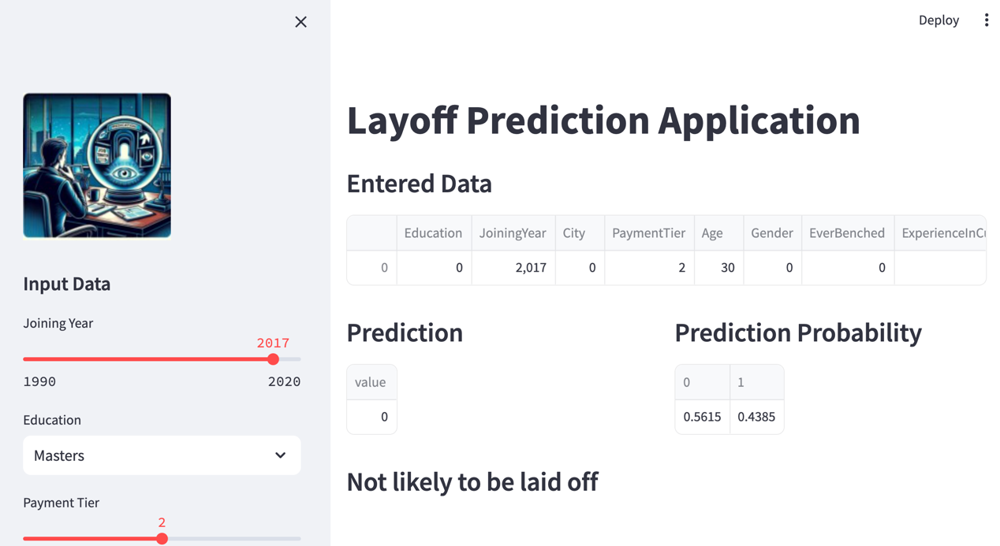

# Data-Driven Web App Guide with Streamlit and AI Model 🌟

Guide on creating a data-driven web application using Streamlit, where an Artificial Intelligence model guides the experience. This README will walk you through setting up the necessary environment, running the application, understanding key Streamlit commands, and provide insight into the code used to create the AI model and the web interface.

## 1. Installing the Necessary Requirements 📦

To get started, make sure your environment is ready by following these steps:

### Prerequisites

- Python 3.6 or later
- pip

### Installation Steps

1. **Create a Virtual Environment (optional):** 
   - Windows: `python -m venv myenv`
   - macOS/Linux: `python3 -m venv myenv`

2. **Activate the Virtual Environment:**
   - Windows: `myenv\Scripts\activate`
   - macOS/Linux: `source myenv/bin/activate`

3. **Install Streamlit and Other Dependencies:**
   ```bash
   pip install streamlit pandas scikit-learn
   ```

## 2. Running Your Application 🏃

To launch the application, use the following command:

```bash
streamlit run your_app.py
```

Make sure to replace `your_app.py` with the actual path to your Streamlit script. Your web browser will automatically open to show the app.

## 3. Key Streamlit Commands 🛠️

Streamlit provides a wide range of commands for building interactive and visually appealing web applications. Here are some of the key commands:

- **Text Display:** `st.write("Text here")` for displaying text.
- **Data Display:** `st.dataframe(data)` and `st.table(data)` for showing data.
- **Charts:** Use `st.line_chart(data)`, `st.bar_chart(data)`, and `st.area_chart(data)` for data visualizations.
- **User Input:** Collect input using `st.slider()`, `st.selectbox()`, `st.text_input()`.
- **Layouts & Containers:** Utilize `st.sidebar`, `st.columns()`, and `st.expander()` to structure your app's UI.
- **Media:** Include images or videos with `st.image(path)` and `st.video(path)`.

## 4. Understanding the Provided Code 📘

### Creating the AI Model with Scikit-learn

The provided Python script demonstrates how to create a logistic regression model capable of predicting outcomes based on your dataset. It involves the following steps:

1. **Data Preprocessing:** Label encoding converts categorical columns into a format that can be provided to the model for training.
2. **Model Training:** Using `train_test_split` to divide the dataset into training and test sets, followed by initializing and training a `LogisticRegression` model.
3. **Evaluation:** The model's performance is evaluated on the test set using `accuracy_score` from scikit-learn.
4. **Saving the Model:** The trained model is saved using `pickle` to be loaded and used within the Streamlit web application.

### Building the Web Application with Streamlit

The second script showcases how to use Streamlit to create a web application that interacts with the trained AI model. It highlights:

- **Setting Up the Web Page:** Configuring the page title, layout, and sidebar through Streamlit functions.
- **User Input:** Using sidebar widgets to collect user input which is then transformed and fed to the loaded model for prediction.
- **Displaying Predictions:** Showcasing the model's prediction and probability in an easy-to-understand format on the web page. 

### Project Overview




The image above showcases the final appearance of our data-driven web application project using Streamlit and an AI model. It illustrates the interactive web interface that users will interact with. This interface allows users to modify input data through various input widgets. Upon changing the data, Streamlit efficiently updates the predictions and any related visualizations in real-time, demonstrating the power and flexibility of Streamlit for building AI-powered applications. This seamless integration between user inputs and model predictions highlights the core functionality of our project, providing an intuitive and engaging user experience.
